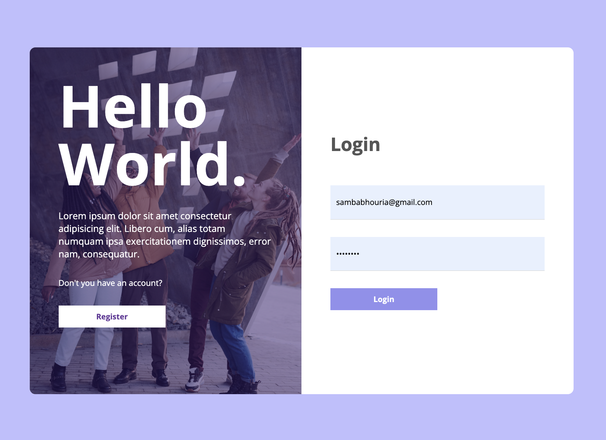
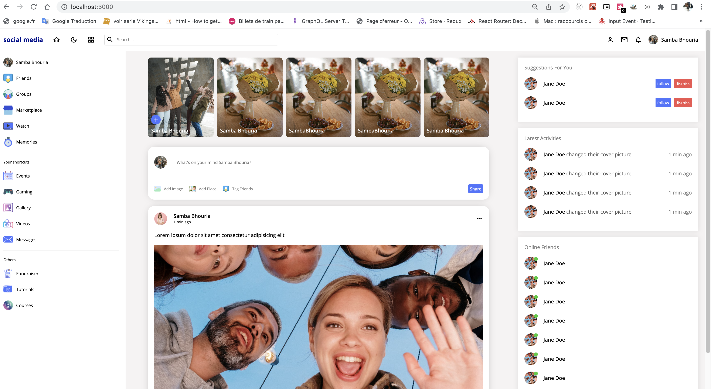
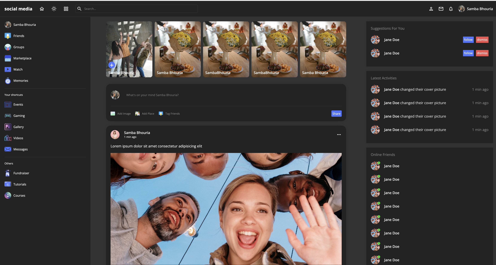
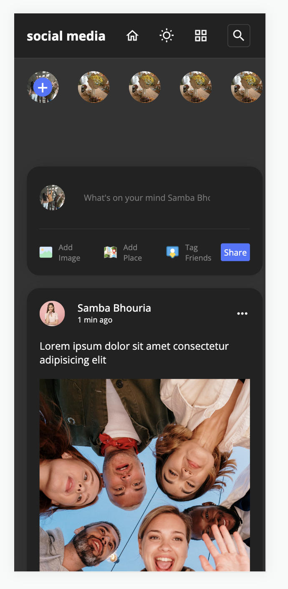
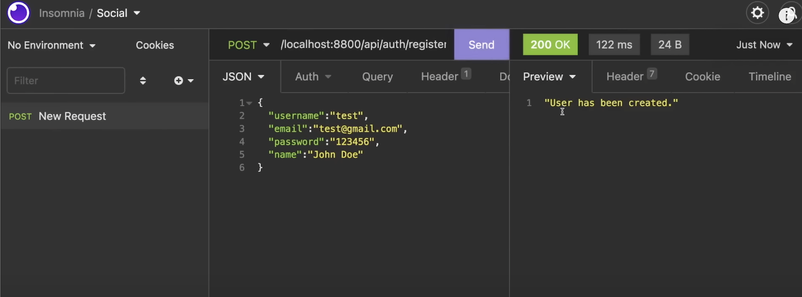
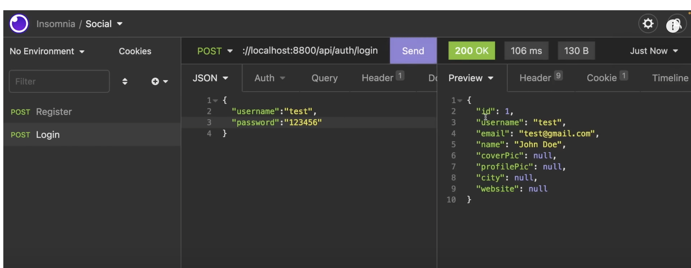
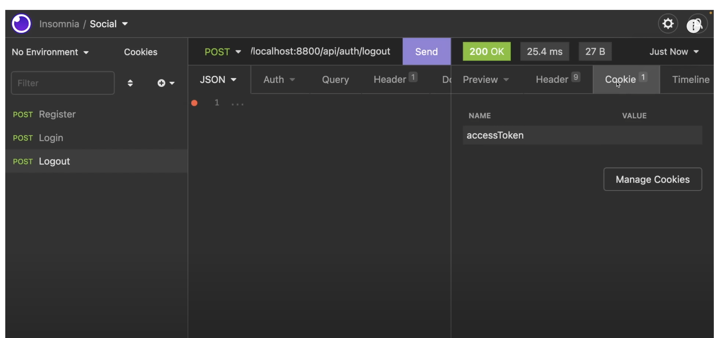

# React.js Real-World Projects React Node.js MySQL Social Media App Tutorial | Full Stack Social Network App
Social network application project using React, Node.js and MySQL. Full-stack Social Media App with hooks, Context API, React-query, JWT, Cookies

# `Tech Front`
    1.React
    1.hooks
    1.Context API
    1.React-query,

# `Tech Backend`
    1.Node
    1.MySQL
    1.JWT
    1.Cookies

# `ScreenShot`

